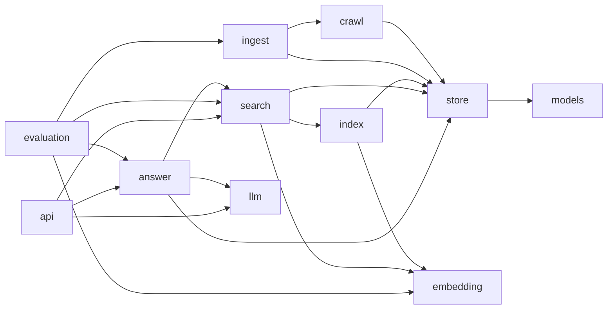

# Digsite

A hybrid search engine (lexical and semantic, with link authority on request)
with a RAG layer on top, built from first principles: every stage of the pipeline is
implemented and tested in this repository, without LangChain, LangGraph or any
other orchestration framework.

A companion project, `digsite-flow`, will rebuild the same pipeline with
LangChain and LangGraph and measure the two against the same questions.

The project is under construction and is delivered in milestones. This README
only describes what exists today. To see how the system works from end to end,
read [`docs/how-it-works.md`](docs/how-it-works.md); to see why it is built the
way it is, [`docs/decisions.md`](docs/decisions.md).

## Status

| # | Milestone | Status |
|---|---|---|
| 1 | Crawler and corpus store | Done |
| 2 | Main-content extraction and de-duplication (exact hash and SimHash) | Done |
| 3 | Inverted index, BM25 and retrieval evaluation | Done |
| 4 | Query expansion by pseudo-relevance feedback | Done |
| 5 | Chunking, embeddings and vector search | Done |
| 6 | PageRank over the link graph and hybrid fusion (RRF) | Done |
| 7 | RAG: query rewriting, passage selection, answers with citations | Done |
| 8 | HTTP API and web UI | Done |
| 9 | Containers (Docker Compose, with Ollama) and continuous integration | Planned |

## Quick start

Requires Python 3.14 or later.

```powershell
python -m venv .venv
.venv\Scripts\activate
pip install -e . --group dev
```

Crawl a section of a site, turn the pages into documents, index them and search:

```powershell
digsite crawl --seed https://docs.python.org/es/3/tutorial/ --prefix https://docs.python.org/es/3/ --max-depth 1
digsite ingest
digsite index --language spanish
digsite search qué hago cuando mi programa falla
digsite serve      # then open http://127.0.0.1:8000/
```

Each result is a document, shown with the section and the start of its best
passage. On the example corpus used throughout this README (86 pages of the
Spanish Python documentation: tutorial, how-tos, FAQ, language reference, setup
guides, glossary and the 3.14 release notes):

```
> digsite search por qué 0.1 + 0.2 no es igual a 0.3
 1.   0.031  15. Floating-Point Arithmetic: Issues and Limitations
             https://docs.python.org/es/3/tutorial/floatingpoint.html
             [15.1. Error de Representación] ``` >>> 3602879701896397 * 10 ** 55 // 2 ** 55 1000000000000000055511151231257827021181583404541015625 ``` lo que significa que el valor exacto almacenado en…
```

Search is hybrid by default: it matches the words of the query and its meaning,
and fuses the two rankings. Matching words alone (`--mode lexical`) does not
put that page among the first five: the query shares little more than numbers
with it.

With [Ollama](https://ollama.com) running and a model pulled
(`ollama pull gemma3:4b`), `digsite ask` answers from the documents and cites
them:

```
> digsite ask diferencia entre lista y tupla
Las listas y las tuplas son ambos tipos de datos de secuencia en Python, pero tienen diferencias clave. Las tuplas están formadas por un número de valores separados por comas, y son inmutables, lo que significa que no pueden ser modificadas después de su creación [2][5]. Las listas, por otro lado, son mutables, lo que significa que sus elementos pueden ser cambiados [6]. Además, las tuplas se utilizan a menudo para representar conjuntos de datos relacionados, como coordenadas, mientras que las listas se utilizan para almacenar colecciones de datos variables [4].

Sources:
 [2] Preguntas frecuentes de programación > Sequences (tuples/lists) > ¿Cómo convertir entre tuplas y listas?
     https://docs.python.org/es/3/faq/programming.html
 [5] Preguntas frecuentes sobre diseño e historia > ¿Por qué hay tipos de datos separados de tuplas y listas?
     https://docs.python.org/es/3/faq/design.html
 [6] Preguntas frecuentes de programación > Core language > ¿Por qué cambiando la lista “y” cambia, también, la lista “x”?
     https://docs.python.org/es/3/faq/programming.html
 [4] Preguntas frecuentes sobre diseño e historia > ¿Por qué hay tipos de datos separados de tuplas y listas?
     https://docs.python.org/es/3/faq/design.html
```

On a laptop CPU with no GPU, an answer takes one to two minutes.

The corpus lives in `data/corpus.db`. `crawl` resumes where the previous run
stopped and `ingest` only extracts pages that have no document yet. `index`
rebuilds the indexes from the current documents, and only computes embeddings
for text it has not embedded before. The first run downloads the embedding
model (about 470 MB); `digsite index --no-embeddings` skips it and leaves only
lexical search.

## Architecture

The pipeline is a chain of stages, each a package: `crawl` downloads pages,
`ingest` extracts and de-duplicates their content, `index` makes it searchable,
`search` ranks it, and `answer` writes answers from it. Underneath, `store`
keeps everything in one SQLite file. On top there are two ways in: `cli`, the
commands, and `api`, the HTTP interface and its page, which `digsite serve`
starts. The arrows below are the imports between packages, as they are in the
code:



(`cli` uses every package, `api` included; `models` and `text` are used by most
and use none.)

- **Dependencies point one way.** A stage uses the stages before it, never the
  ones after; the store uses only the domain types in `models`; nothing but the
  entry point uses `cli`, and nothing but `cli` starts `api`; `api` serves what
  the pipeline built and builds nothing itself; and `llm` and `embedding` know
  nothing of the corpus.
  `tests/test_architecture.py` reads the imports of every module and fails if
  any of this stops being true.
- **Interfaces where there are alternatives.** `Retriever` is anything that
  ranks items for a query: lexical, semantic and hybrid search, and the
  wrappers that group passages into documents or search for several wordings
  of a question, all have that shape, so fusion and evaluation treat them
  alike. `Embedder` and `LanguageModel` are the same for models. They are
  protocols, matched by shape; nothing inherits from anything.
- **Plain functions for algorithms, classes for state.** BM25 ranking, fusion,
  PageRank, chunking and the metrics are functions over data. Indexes,
  searchers, stores and clients are classes.
- **Wiring in two places.** `CorpusSearch` builds the retrievers from what the
  index stage stored and finds documents with them, and `Answerer.for_corpus`
  builds the answer stage on top of it. The command line and the HTTP interface
  only read their input, call these two and present the result: a search gives
  the same documents in the terminal and in the browser.
- **The HTTP interface is handed what it serves.** `create_app` receives the
  corpus and the language model already built; it opens no files. The server
  passes the real ones, the tests a small corpus and a scripted model. Its
  request and response types are its own, kept apart from the domain types.
- **Tests at the edges.** The crawler runs against an in-memory website and the
  Ollama client against a simulated server; a hashing embedder stands in for
  the neural model and a scripted model for the language model. No test
  touches the network; the few that load the real embedding model are opt-in.

`docs/decisions.md` explains the choices one by one.

## Commands

Every command takes `-v` for debug output and, where it applies, `--data-dir DIR`
(default `data`).

### `digsite crawl`

| Option | Meaning | Default |
|---|---|---|
| `--seed URL` | Start URL; repeatable | required |
| `--prefix URL` | URL prefix the crawl may visit; repeatable | hosts of the seeds |
| `--exclude URL` | URL prefix the crawl must stay out of; repeatable | none |
| `--max-pages N` | HTML pages to store in this run | 100 |
| `--max-depth N` | Maximum hops from a seed | 5 |
| `--delay S` | Seconds between requests to the same host | 1.0 |
| `--user-agent UA` | How the crawler identifies itself | `digsite/<version>` |

For anything beyond a small test crawl, pass a `--user-agent` that includes a
way to contact you. Use `--exclude` for pages that are lists of links and not
content, such as alphabetical indexes: they add thousands of passages that
match everything a little.

### `digsite ingest`

| Option | Meaning | Default |
|---|---|---|
| `--max-distance N` | Fingerprint bits two near-duplicates may differ in | 6 |
| `--force` | Extract every page again, not only the new ones | off |

### `digsite index`

| Option | Meaning | Default |
|---|---|---|
| `--language NAME` | `english` or `spanish`: stop-word list and stemmer | none (plain words) |
| `--keep-stopwords` | Do not remove the language's stop words | off |
| `--no-stemming` | Do not reduce words to their stems | off |
| `--max-chars N` | Largest chunk, in characters | 1000 |
| `--model NAME` | sentence-transformers model to embed with, or `hashing` | `intfloat/multilingual-e5-small` |
| `--no-embeddings` | Build only the lexical index | off |

`--model hashing` is a model-free embedder that needs no download. It only
captures shared words, and is there for tests and smoke runs.

`index` also scores every document by the links it receives from the others
(PageRank), whatever the options.

### `digsite search QUERY`

| Option | Meaning | Default |
|---|---|---|
| `--mode NAME` | `lexical` (words, BM25), `semantic` (meaning, embeddings) or `hybrid` (both, fused) | `hybrid` |
| `--limit N` | Maximum number of results | 10 |
| `--rank-constant N` | In hybrid search, how little the first positions of each ranking stand out | 60 |
| `--authority-weight X` | In hybrid search, how much the links a document receives count, a retriever counting 1 | 0 (ignored) |
| `--variant NAME` | `lucene`, `robertson`, `atire`, `bm25l` or `bm25+` | `lucene` |
| `--k1 X` | Term-frequency saturation | 1.2 |
| `--b X` | Length normalisation | 0.75 |
| `--expand` | Add to the query the terms that characterise its best results | off |
| `--feedback-documents N` | With `--expand`, results taken as relevant | 2 |
| `--expansion-terms N` | With `--expand`, terms added to the query | 40 |
| `--expansion-weight X` | With `--expand`, weight of each added term | 0.15 |

A lexical query is analyzed with the settings the index was built with, and a
semantic one is embedded with the model the index was built with. The ranking
and expansion options apply to lexical search and to the lexical half of hybrid
search. With `--expand`, the added terms are printed before the results. On a
corpus indexed with `--no-embeddings`, the default mode is lexical.

`--authority-weight` is for queries that look for the front page of a section
and not for a passage; see the evaluation below before using it.

### `digsite ask QUESTION`

Answers a question from the indexed documents with a language model served by
[Ollama](https://ollama.com), citing the passages the answer comes from, or
says that the documents do not answer it.

| Option | Meaning | Default |
|---|---|---|
| `--llm NAME` | Language model, as `ollama list` shows it | `gemma3:4b` |
| `--llm-url URL` | Where Ollama listens | `http://localhost:11434` |
| `--mode NAME` | How passages are searched for: `lexical`, `semantic` or `hybrid` | `hybrid` |
| `--passages N` | Passages given to the model | 6 |
| `--rewrites N` | Searches the model adds to the question; 0 searches only for it as typed | 2 |
| `--show-passages` | Print every passage the model was given, not only the ones it cites | off |

The model is called twice: once to read the question (what is being asked,
what kind of answer it calls for, and how else to search for it) and once to
write the answer from the passages found. Any model Ollama serves can be used;
the prompts are plain on purpose, and the answers are only as good as the
model. See the limitations below.

### `digsite serve`

Serves search and answers over HTTP, and a page to use them from a browser, at
`http://127.0.0.1:8000/`. The corpus is opened read-only, and the indexes and
the embedding model are loaded before the first request. Takes the options of
`digsite ask` except `--show-passages`, with `--mode` as the default search
mode, and:

| Option | Meaning | Default |
|---|---|---|
| `--host ADDRESS` | Address to listen on | `127.0.0.1`, this computer only |
| `--port N` | Port to listen on | 8000 |

| Endpoint | Does |
|---|---|
| `GET /` | The page: one box to search or ask, results, and answers with their sources |
| `GET /api/search?q=…&mode=…&limit=…` | Documents that match, each with its best passage |
| `POST /api/ask` with `{"question": …, "mode": …}` | An answer and the passages it was written from, or `answered: false` |
| `GET /api/status` | What the corpus holds, and the search modes it allows |
| `GET /api/docs` | The interface, described and callable from the browser |

Search works without the language model. If Ollama is not running, asking
returns 503 with the reason. The address of the page holds the query
(`/?q=…&mode=…&ask=1`), so a search can be reloaded, shared or gone back to.

### `digsite authority`

Lists the documents with the highest link score, each with its PageRank and how
many times the score of an average document that is. Takes `--limit N`
(default 10).

### `digsite stats`

Shows what the corpus contains: pages, links, documents, duplicates, chunks,
index terms, embedded chunks, link-scored documents and the embedding model.

### `digsite eval retrieval`

Scores search on a test collection in the BEIR layout. Takes `--dataset DIR`,
`--retriever lexical` (default), `semantic` or `hybrid`, and the analysis,
ranking, expansion, `--model` and `--rank-constant` options above. Document
embeddings are cached in the dataset directory, so only the first semantic run
is slow.

`--retriever` can be repeated to compare several. Each one after the first
then gets a p-value: how likely a difference in nDCG@10 from the first as
large as the one observed would be if the two were equally good (a paired
randomisation test over queries).

```powershell
python scripts/fetch_cranfield.py data/benchmarks/cranfield
python scripts/fetch_beir.py scifact data/benchmarks
digsite eval retrieval --dataset data/benchmarks/cranfield --language english
digsite eval retrieval --dataset data/benchmarks/scifact --language english --retriever hybrid --retriever lexical --retriever semantic
```

```
5183 documents, 300 queries
retriever     nDCG@10      MAP      MRR     P@10    R@100        p
hybrid         0.7155   0.6757   0.6865   0.0947   0.9577
lexical        0.6870   0.6425   0.6517   0.0913   0.9242   0.0045
semantic       0.6770   0.6355   0.6499   0.0903   0.9250   0.0055
```

### `digsite eval search`

Scores search on the crawled corpus against queries labelled with the pages
that answer them, through the same code as `digsite search`. Takes
`--queries FILE`, and the options of `digsite search` except `--mode` and
`--limit`. Without `--retriever` it scores every mode the corpus was indexed
for. With `--authority-weight` it adds a row for hybrid search with link
authority, next to plain hybrid search. With `--rewrites N` (and `--llm`,
`--llm-url`), it adds a row for hybrid search that also runs the N searches a
language model adds to each query, as `digsite ask` does.

The file has one query per line, followed by the URLs of its relevant pages,
separated by tabs. `benchmarks/python-docs-es/` has two such files for the
example corpus, and explains how they were made.

```powershell
digsite eval search --queries benchmarks/python-docs-es/queries.tsv
digsite eval search --queries benchmarks/python-docs-es/navigational.tsv --retriever hybrid --authority-weight 0.5
```

### `digsite eval answers`

Asks every question of a file of labelled queries and scores the answers by
where they point: how many questions were answered, how many answers cite a
page judged relevant, how many cite nothing, and what share of all citations
point to a relevant page. With `--unanswerable FILE`, it also asks questions
the corpus does not answer and reports how many were declined. It does not
judge whether the text of an answer is right.

Takes `--queries FILE`, the options of `digsite ask`, `--limit N` to ask only
the first questions, and `--output FILE` to keep every answer as a line of
JSON. A run that stops can be resumed with the same `--output`: the questions
already answered are not asked again.

```powershell
digsite eval answers --queries benchmarks/python-docs-es/queries.tsv --unanswerable benchmarks/python-docs-es/unanswerable.tsv --output data/answers.jsonl
```

### `digsite eval near-duplicates`

Scores near-duplicate detection against a labelled collection.

| Option | Meaning | Default |
|---|---|---|
| `--texts FILE` | One `id text` entry per line | required |
| `--pairs FILE` | One duplicate `id id` pair per line | required |
| `--bits N` | Fingerprint length | 64 |
| `--shingle-size N` | Words per shingle | 2 |
| `--distance N` | Maximum Hamming distance to score; repeatable | 6 |

## How it works

This section lists what each stage does.
[`docs/how-it-works.md`](docs/how-it-works.md) follows one page and one
question through the whole system, step by step, with what is measured at each
step.

### Crawl

- **Canonical URLs.** Fragments, default ports, credentials and tracking
  parameters are dropped, relative references are resolved and the query string
  is sorted, so `/#history` and `/#figures` are one page, downloaded once.
- **Politeness.** It obeys `robots.txt`, including `Crawl-delay`, following
  RFC 9309; it spaces out requests to the same host; and it identifies itself
  with its own User-Agent.
- **Scope.** Only URLs under the allowed prefixes are visited. Links that leave
  the scope are recorded in the graph but not followed.
- **Redirects.** They are recorded, and the target goes through the same checks
  (scope, `robots.txt`, pacing) as any other URL.
- **Link graph.** Every link is stored with its anchor text and `nofollow`
  flag. This graph is the input to PageRank.
- **Original HTML.** Bodies are stored compressed, exactly as received, so
  later stages can be re-run without downloading anything again.
- **Failures.** A network error, an HTTP error or a non-HTML resource is
  recorded with its reason and the crawl carries on.

### Ingest

- **Main content.** Menus, sidebars and footers are removed and the article is
  kept as Markdown, headings included, so that documents can later be split by
  section. Pages marked `noindex` are left out.
- **Exact duplicates.** Documents whose text is identical up to whitespace
  share a SHA-256 hash. This catches `/` and `/index.html`.
- **Near-duplicates.** Each document gets a 64-bit SimHash fingerprint of its
  distinct two-word shingles. Two documents whose fingerprints differ in at
  most 6 bits are near-duplicates. The lookup uses block tables (Manku et al.,
  2007), so a document is compared only with the few that share a block of
  bits with it, not with the whole corpus.
- **Canonical document.** Of a group of duplicates, the page crawled first
  stands for the rest. Only canonical documents go on to be indexed.

### Index

- **Chunks.** Documents are split into passages of at most 1,000 characters,
  along their own structure: never across a heading; paragraphs packed together
  while they fit; a paragraph that is too long split at line breaks, then
  between sentences, then between words. A code block is kept whole, and a
  `# comment` inside one is not taken for a heading.
- **Context.** Every chunk is indexed with its heading path in front
  (`Title > Section > Subsection`), so a passage taken out of its page still
  says what it is about.
- **Analysis.** Text becomes terms: case-folded words, optionally without the
  language's stop words and reduced to their stems. The settings are stored
  with the index, and queries go through the same analysis.
- **Inverted index.** For every term, the chunks that contain it and how
  often, as packed integer arrays.
- **Embeddings.** Every chunk also becomes a vector of 384 numbers, computed by
  a multilingual model (`intfloat/multilingual-e5-small`) on the CPU. Texts
  that mean similar things get vectors that point in similar directions,
  whatever words or language they use. Vectors are stored under the hash of
  their text, so re-indexing only embeds what changed: after a change to the
  chunker, 125 of 3,352 chunks were embedded again.
- **Link authority.** The links of the crawl are reduced to links between
  indexed documents: followed through redirects, attributed to the document
  that stands for a duplicate, and dropped if they leave the corpus or are
  marked `nofollow`. Every document then gets its PageRank over that graph: the
  share of time a reader following links at random would spend on it. The
  implementation is checked against `networkx` in the tests.

### Search

Every mode ranks chunks and shows documents, each represented by its best chunk.

- **Lexical (BM25).** A chunk's score for a query is the sum, over the query
  terms it contains, of the term's rarity in the collection times a saturating
  function of its frequency in the chunk, corrected for chunk length. Five
  published formulations are available.
- **Semantic.** The query is embedded with the same model and compared with
  every chunk vector; the score is the cosine of the angle between them. The
  comparison is exact, one matrix product, with no approximate index.
- **Hybrid.** The query is run through both, and the two rankings are fused by
  reciprocal rank: a chunk scores `1 / (60 + position)` in each ranking it
  appears in, and the scores are added. Only positions are used, so BM25 scores
  and cosines never have to be made comparable. A chunk that both rankings
  place high beats the favourite of either.
- **Link authority.** On request, the ranking of documents by PageRank takes
  part in the fusion as a third, weighted ranking. It reorders what the other
  two found and never adds a result.
- **Query expansion.** Optionally, in lexical search, the best results of the
  query are taken as relevant, and the terms that are unusually frequent in
  them compared with the rest of the collection (by log-likelihood ratio) are
  added to the query with a low weight. A document can then be found without
  sharing a word with what the user typed.

### Answer

- **Reading the question.** The language model is asked what language the
  question is in, what it is after, what kind of answer it calls for (a fact,
  steps, an explanation, or a page), its key terms, and the same in English.
  The reply is a JSON document that Ollama constrains to a schema.
- **Searching.** The question and the two added queries are searched for, and
  the rankings are fused by reciprocal rank. The English query is the one that
  helps, in a corpus that is half English.
- **Selecting passages.** The six best chunks are kept, at most three from any
  one document, and numbered.
- **Writing.** The model is given the numbered passages and asked to answer
  only from them, in the language of the question, citing each statement, or to
  say that it cannot. Citations are read from the answer by code: numbers that
  match no passage are ignored, and `sys.argv[1]` is not taken for a citation.
  Only the cited passages are listed with the answer.

### Serve

- **One corpus, many requests.** The server builds `CorpusSearch` once: the
  inverted index and every chunk vector stay in memory, and each request only
  reads a few chunks and documents from the database. Requests run in a pool of
  threads that share one read-only connection.
- **The page** is three static files and no framework: the server's JSON is put
  on the page as text, never as markup, and the page is served with a content
  security policy that only allows scripts from the server itself. Answers are
  shown with their citations as links to the passages, and every passage the
  model was given can be opened.

## Evaluation

### Retrieval on public collections

Scored with `digsite eval retrieval`. Lexical is BM25 in Lucene's formulation
with k1 = 1.2, b = 0.75, English stop words removed and stemming. Semantic is
`intfloat/multilingual-e5-small`, one vector per document (these collections
are abstracts, short enough for the model to read whole). Hybrid is their
fusion by reciprocal rank with the standard constant, 60, and equal weights:
nothing was tuned.

| Collection | Documents | Queries | Retriever | nDCG@10 | MAP | MRR | P@10 | Recall@100 |
|---|---|---|---|---|---|---|---|---|
| Cranfield | 1,400 | 225 | Lexical | 0.369 | 0.308 | 0.543 | 0.236 | 0.746 |
| | | | Semantic | 0.354 | 0.284 | 0.523 | 0.233 | 0.723 |
| | | | Hybrid | 0.389 | 0.325 | 0.548 | 0.255 | 0.762 |
| SciFact | 5,183 | 300 | Lexical | 0.687 | 0.643 | 0.652 | 0.091 | 0.924 |
| | | | Semantic | 0.677 | 0.636 | 0.650 | 0.090 | 0.925 |
| | | | Hybrid | 0.716 | 0.676 | 0.687 | 0.095 | 0.958 |
| TREC-COVID | 171,332 | 50 | Lexical | 0.662 | 0.232 | 0.899 | 0.692 | 0.128 |

A small general-purpose embedding model, used as is, comes close to BM25 on
these collections and does not beat it. Fusing the two beats both. By a paired
randomisation test over queries, the gain in nDCG@10 over lexical search has
p = 0.015 on Cranfield and p = 0.005 on SciFact, and over semantic search
p < 0.001 and p = 0.006. Semantic and hybrid retrieval were not run on
TREC-COVID: embedding its 171,332 documents would take about 12 hours on the
laptop CPU this was developed on.

### Search on the example corpus

Scored with `digsite eval search` on the queries of
`benchmarks/python-docs-es/`, written and judged for this corpus: 70 questions
with 142 relevant pages, and 12 searches for the front page of a section.
Results are documents.

| Queries | Mode | nDCG@10 | MAP | MRR |
|---|---|---|---|---|
| 70 questions | Lexical | 0.752 | 0.680 | 0.783 |
| | Semantic | 0.852 | 0.803 | 0.866 |
| | Hybrid | 0.825 | 0.763 | 0.843 |

This corpus does not repeat what the public collections show. Hybrid search is
well above lexical search (p < 0.001) and below semantic search alone, by a
difference that 70 queries cannot tell from noise (p = 0.17). Two things make
the lexical half weak here, and with it the fusion: the corpus mixes Spanish
and English pages and its index is analyzed as Spanish, and the queries are
mostly natural-language questions, with few exact identifiers. For
"novedades de la versión 3.14", semantic search puts the release notes, which
are in English, first; lexical and hybrid search put them fourth, behind pages
that repeat "versión 3.14".

Hybrid is still the default: it is the best mode on the two collections whose
queries were not written here, and never the worst. On a corpus like this one,
`--mode semantic` is a reasonable choice, and `digsite eval search` is there to
make it on evidence.

Link authority (`--authority-weight`), nDCG@10 of hybrid search, with the
p-value against no authority:

| Authority weight | 70 questions | 12 front-page searches |
|---|---|---|
| 0 | 0.825 | 0.724 |
| 0.1 | 0.829 (p = 0.44) | 0.802 (p = 0.12) |
| 0.5 | 0.801 (p = 0.06) | 0.886 (p = 0.03) |

Links help to find the front page of a section and do not help to answer a
question. The pages with the highest PageRank on this site are the ones every
page links to: the home page and the bug-reporting, copyright and feedback
pages hold 48% of the score between the four of them. So authority is off by
default. Twelve queries are too few to set a default weight by.

Over 3,352 chunks, a lexical query takes 0.3 ms, a semantic one 26 ms and a
hybrid one 29 ms (medians over the 70 questions), once the model is loaded.
Over HTTP, through `digsite serve`, a hybrid search takes about 40 ms.

### Answers on the example corpus

Scored with `digsite eval answers`, with `gemma3:4b` served by Ollama on a
laptop CPU, default settings (hybrid search, the question plus two rewritten
queries, six passages):

| 70 questions that the corpus answers | |
|---|---|
| Answered | 98.6% |
| Answer cites a page judged relevant | 91.4% |
| Answer cites nothing | 0% |
| Citations that point to a relevant page | 71.6% |
| A relevant page was among the six passages | 95.7% |

| 18 questions that it does not answer | |
|---|---|
| Declined | 83.3% (15) |

The three it should have declined show the two ways a small model fails. For
"cómo leer una hoja de Excel" and "cuál es la capital de Australia" it answered
something else, about reading files and about comparing Unicode strings, from
passages that do say it. For "cómo crear un DataFrame con pandas" it wrote
code calling `pd.DataFrame()` and cited a passage that never mentions pandas:
an invented answer, with a citation that does not support it. Of the
answerable questions, it declined only "subcomandos en argparse".

These figures say where the answers point, not whether they are right: the
answers to the 70 answerable questions were not read one by one. With
temperature 0 and a fixed seed they are reproducible: an earlier run that
stopped after 83 questions had given, for each of them, the same passages, the
same verdict and the same text. The 88 questions took about 2 hours 10
minutes, usually 12 to 20 seconds to read a question and 50 to 100 to write
its answer.

### Lexical search in detail

Two reference points for BM25's nDCG@10:

- The BEIR paper reports 0.656 on TREC-COVID for Lucene's BM25. Its setup
  differs in parameters and in indexing title and text as separate fields, so
  this shows the implementation is in the expected range, not that it is
  identical.
- The `bm25s` library (0.3.11), run on the same files and scored with the same
  metric code, gives 0.609 on TREC-COVID and 0.360 on Cranfield with its own
  tokenizer and stop-word list.

What the text goes through matters more than the BM25 formulation (nDCG@10):

| Analysis | Cranfield | TREC-COVID |
|---|---|---|
| Plain words | 0.331 | 0.581 |
| Stop words removed | 0.342 | 0.595 |
| Stemming | 0.361 | 0.605 |
| Stop words removed and stemming | 0.369 | 0.662 |

On a laptop CPU, TREC-COVID is indexed in about 30 seconds (16 million
postings) and a query takes about 8 ms. `docs/decisions.md` has the comparison
of BM25 formulations.

Query expansion (`--expand`, default settings) against the same BM25:

| Collection | nDCG@10 | MAP | MRR | Recall@100 |
|---|---|---|---|---|
| Cranfield | 0.369 → 0.390 | 0.308 → 0.332 | 0.543 → 0.542 | 0.746 → 0.769 |
| TREC-COVID | 0.662 → 0.690 | 0.232 → 0.259 | 0.899 → 0.887 | 0.128 → 0.136 |

By a paired randomisation test over queries, the gains in MAP are significant
on both collections (p < 0.001), and so are those in nDCG@10 and recall on
Cranfield. On TREC-COVID, with 50 queries, the changes in nDCG@10 (p = 0.17)
and recall (p = 0.13) are not. The first result does not improve on either.
The settings were chosen on these same collections, so the gains are an upper
estimate. Expansion roughly triples the time per query.

### Near-duplicate detection

Scored with `digsite eval near-duplicates` on news article collections with
labelled duplicate pairs (the data is not part of this repository):

| Collection | True pairs | Distance | Precision | Recall | F1 |
|---|---|---|---|---|---|
| 1,000 articles | 10 | 6 | 1.000 | 0.900 | 0.947 |
| 2,500 articles | 20 | 6 | 1.000 | 0.950 | 0.974 |
| 10,000 articles | 80 | 6 | 1.000 | 0.988 | 0.994 |
| 10,000 articles | 80 | 10 | 1.000 | 1.000 | 1.000 |

On 38,301 questions with 64,846 pairs labelled as asking the same thing,
recall is 0.01: those pairs mean the same but share few words, which a lexical
fingerprint cannot see. Semantic similarity is the job of the embeddings.

On a 65-page crawl of the Spanish Python documentation, ingest produced 63
unique documents, found the one true duplicate (`/index.html`) and flagged no
near-duplicates; the closest pair of distinct documents is 18 bits apart.

The SimHash implementation was also checked against an established library:
given the same hash function and features, it reproduces that library's
recorded results on two collections exactly.

## Project layout

```
src/digsite/
  models.py            domain types shared by the stages and the store
  text.py              tokenisation
  cli/                 command-line interface, one module per group of commands
  api/                 HTTP interface
    app.py               the application: endpoints over a corpus and a language model
    schemas.py           what the endpoints accept and return
    static/              the page: HTML, CSS and JavaScript, no build step
  crawl/               crawl stage
    urls.py              URL canonicalisation and crawl scope
    parsing.py           links, title and robots directives from HTML
    robots.py            robots.txt lookup and caching
    throttle.py          per-host request pacing
    fetcher.py           HTTP download of one page
    frontier.py          queue of URLs waiting to be crawled
    crawler.py           the crawl loop
  ingest/              ingest stage
    content.py           main-content extraction
    simhash.py           SimHash fingerprints
    simhash_index.py     lookup of fingerprints within a Hamming distance
    dedup.py             exact and near-duplicate detection
    pipeline.py          the stage itself
  index/               index stage
    chunking.py          documents to passages
    analyzer.py          text to terms: stop words and stemming
    stopwords.py         stop-word lists
    inverted_index.py    the inverted index and its builder
    vector_index.py      exact nearest-neighbour search over vectors
    lexical_index_store.py  the inverted index saved in the corpus database
    link_graph.py        links between pages to links between documents
    pagerank.py          importance of each node of a graph
    pipeline.py          the stage itself
  embedding/           text to vectors
    base.py              the interface every embedder implements
    sentence_transformer.py  embeddings from a sentence-transformers model
    hashing.py           model-free embedder for tests and smoke runs
  search/              search stage
    retriever.py         the interface every retriever implements
    bm25.py              BM25 ranking, five formulations
    expansion.py         query expansion by pseudo-relevance feedback
    lexical.py           free-text queries against the inverted index
    dense.py             free-text queries against the vector index
    fusion.py            several rankings into one, by reciprocal rank
    hybrid.py            several retrievers asked at once, their rankings fused
    grouping.py          chunk results to document results
    multi_query.py       several wordings of one query, searched and fused
    corpus.py            the retrievers of an indexed corpus, by search mode
    results.py           documents as a search shows them
  llm/                 language models
    base.py              the interface every language model implements
    ollama.py            models served by Ollama
    replies.py           reading the JSON a model replies with
  answer/              answer stage
    plan.py              what a question asks and how else to search for it
    generate.py          the answer, written from passages and citing them
    pipeline.py          the stage itself
  evaluation/          offline evaluation against labelled data
    metrics.py           precision, recall, F1 of sets
    ranking_metrics.py   nDCG, MAP, MRR, precision and recall at k
    retrieval.py         retrieval benchmark on labelled queries
    significance.py      paired randomisation test between two systems
    answers.py           answers scored by the pages they cite
    near_duplicates.py   near-duplicate detection benchmark
  store/               persistence
    database.py          SQLite connection and schema migrations
    crawl_store.py       pages, original HTML and the link graph
    document_store.py    documents and duplicate marks
    chunk_store.py       chunks and their embeddings
    authority_store.py   link score of each document
benchmarks/            labelled queries for the example corpus
scripts/               download test collections
tests/                 mirrors the package; no test touches the network
  test_architecture.py   the rules of the dependencies between packages
docs/decisions.md      why things are the way they are
```

## Known limitations

- The crawler does not run JavaScript: it only sees the HTML the server returns.
- Requests are sequential. With per-host pacing, concurrency would only pay
  off when crawling many hosts at once.
- URLs that failed are not retried by later runs, and stored pages are never
  refreshed.
- Extraction takes about 0.3 s per page in a single process.
- The near-duplicate settings were chosen and scored on the same article
  collections; there is no held-out set, and only one real crawl to check them
  against.
- Changing the fingerprint settings in the code requires `digsite ingest --force`.
- Hybrid search is not the best mode on every corpus: on the example corpus,
  semantic search alone scores higher. A retriever that is confidently wrong
  pulls the fusion down, because a chunk that both rank thirtieth outscores one
  that only one of them ranks first.
- Link authority is off by default and, on a single site, mostly reflects its
  navigation: the pages every page links to. It was measured on 12 queries.
- The queries for the example corpus were written and judged while building
  the system, by no independent assessor, and lean towards natural-language
  questions. See `benchmarks/python-docs-es/README.md`.
- The embedding model favours passages in the language of the query: an
  unrelated passage in that language can outrank the answer in another one. Its
  scores are also packed into a narrow range (about 0.74 to 0.90), so they rank
  results but do not say whether any of them is relevant.
- Embedding runs on the CPU at about 5 chunks per second: 10 to 15 minutes for
  the 3,352 chunks of the example corpus, the first time. Each `digsite search`
  in hybrid or semantic mode spends about 15 seconds loading the model before
  a query that takes under 30 ms.
- Vector search compares the query with every chunk. That is milliseconds for
  thousands of chunks and would need an approximate index for millions.
- Chunks do not overlap: a fact split across a boundary is in neither whole.
- A code block left unclosed in a document hides the headings after it.
- The lexical index has one language. The example corpus mixes Spanish and
  English pages and is analyzed as Spanish.
- Query expansion pools the terms of the feedback documents, so a very long one
  dominates. It was tuned on collections of abstracts of similar length; on the
  example corpus, where pages differ a lot in length, it helps some queries and
  derails others. It is off by default.
- The indexes are loaded whole into memory, and the lexical one is rebuilt from
  scratch when the documents change.
- The snippet of a result is the start of its best passage, not the words that
  matched.

- The answers are only as good as the language model. With `gemma3:4b` on a
  CPU, an answer takes one to two minutes, and the model sometimes answers a
  question from passages that only share words with it instead of declining;
  `digsite eval answers` measures how often. No attempt is made to correct
  that beyond the prompt: the model is meant to be swapped for a better one.
- Answers are returned whole, not streamed as they are written: on the page,
  a question shows only a timer for a minute or two.
- The HTTP interface has no authentication and no limit on requests. It is
  meant for this computer, which is why it listens on 127.0.0.1 by default. With
  one CPU-bound language model, questions asked at once wait for each other.
- Each question stands alone: there is no conversation, and a follow-up
  question does not know the one before.
- Windows paths in an answer can come out mangled: the model writes them into
  a JSON string without escaping the backslashes.
- `digsite eval answers` checks where an answer points, not whether what it
  says is right.

## Development

```powershell
pytest                 # tests
pytest -m model        # tests that load the real embedding model (downloads it)
ruff check .           # lint
ruff format --check .  # formatting
mypy                   # strict type checking
```

The crawler is tested against an in-memory fake site, with no network access
and no real waiting.
