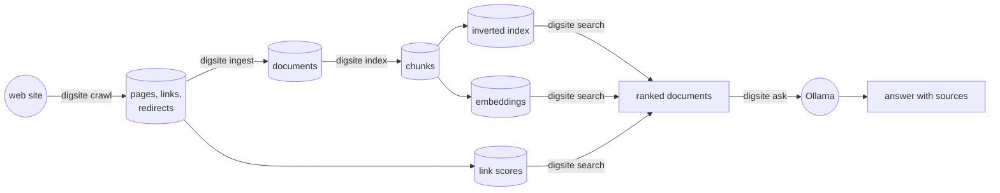

# How Digsite works

This document follows the system end to end on the example corpus: first one
page, from the web to the indexes, then one question, from the keyboard to an
answer with sources. Every number in it was measured on that corpus: 86 pages
of the Spanish Python documentation, crawled on 30 September 2026.

The README says what each command does; `docs/decisions.md` says why each
choice was made. This document says what happens, in order, and where in the
code it happens.

## The whole picture



Each stage reads what the previous one stored and writes its own output to
the same SQLite file, `data/corpus.db`. Stages can be re-run independently:
`ingest` again after changing the extractor, `index` again after changing the
chunker, without downloading anything. `crawl` and `ingest` resume where they
stopped; `index` rebuilds, reusing every embedding whose text did not change.

| Table | Written by | Holds |
|---|---|---|
| `pages` | crawl | every requested URL: the HTML as received (zlib-compressed), or why it was skipped |
| `links` | crawl | every link of every page, with its anchor text and `nofollow` flag |
| `redirects` | crawl | where each redirecting URL points |
| `documents` | ingest | the main content of each page, as Markdown, and its duplicate marks |
| `chunks` | index | the passages documents are split into, with their heading paths |
| `lexical_items`, `lexical_terms` | index | the inverted index: postings packed as integer arrays |
| `embeddings` | index | one vector per distinct chunk text and model |
| `authority` | index | the PageRank of each document |
| `settings` | index | how the lexical index was analyzed, which model embedded the chunks |

The schema is versioned inside the file (`PRAGMA user_version`); an older file
is upgraded in place the next time it is opened (`store/database.py`).

## The journey of a page

We follow <https://docs.python.org/es/3/tutorial/datastructures.html>, the
tutorial chapter on data structures.

### 1. Crawl: from the web to the database

`digsite crawl` (`crawl/crawler.py`) runs a breadth-first search from the seed
URLs:

1. **Take the next URL from the frontier** (`crawl/frontier.py`), a queue
   ordered by depth: every page one link away from a seed is visited before any
   page two links away.
2. **Check it may be fetched.** The URL must be under an allowed prefix and
   under none of the excluded ones (`crawl/urls.py`, `Scope`); it must not end
   in an extension that is never HTML (`.pdf`, `.zip`, images…); and the
   site's `robots.txt` must allow it (`crawl/robots.py`). `robots.txt` is
   downloaded once per site and read as RFC 9309 says: a missing file allows
   everything, a failing server (5xx, 429, network error) forbids everything.
3. **Wait its turn** (`crawl/throttle.py`). Requests to one host are spaced by
   one second, or by the `Crawl-delay` the site asks for if that is longer.
   The clock and the sleep are injected, so tests run without waiting.
4. **Fetch it** (`crawl/fetcher.py`). The HTTP layer does not follow
   redirects: a redirect is recorded, and its target goes back through steps 2
   and 3 like any other URL, so a redirect cannot lead the crawler out of scope
   or around `robots.txt`. Bodies over 5 MB and anything that is not HTML are
   recorded as skipped, with the reason.
5. **Parse it** (`crawl/parsing.py`): the title, the `robots` meta tag
   (`noindex`, `nofollow`), and every link with its anchor text.
6. **Canonicalize every link** (`crawl/urls.py`, `canonicalize`): relative
   references are resolved; fragments, default ports, credentials and
   tracking parameters (`utm_*`, `fbclid`…) are dropped; the query string is
   sorted. So `/#history` and `/#figures` are one page, downloaded once.
7. **Store** (`store/crawl_store.py`): the page and its links in one
   transaction, the HTML compressed exactly as received. Links that leave the
   scope are stored too, because they are part of the link graph, but they are
   not followed, and neither are `nofollow` links.

The data structures page came as 106 kB of HTML, stored in 18 kB, with 27
outgoing links. The whole crawl stored 86 pages and 3,728 links, of which 880
point to another stored page; one URL was skipped (a change log over 5 MB).

### 2. Ingest: from HTML to documents

`digsite ingest` (`ingest/pipeline.py`) turns each stored page into a document
and marks the duplicates:

1. **Extract the main content** (`ingest/content.py`). `trafilatura` removes
   menus, sidebars and footers and keeps the article as Markdown, headings
   included, because the next stage splits documents by section. Pages marked
   `noindex` are left out. The data structures page became 24,345 characters
   of Markdown.
2. **Find exact duplicates** (`ingest/dedup.py`): documents whose text is the
   same up to whitespace share a SHA-256 hash. This is what catches `/` and
   `/index.html`.
3. **Find near-duplicates** (`ingest/simhash.py`). Each document gets a 64-bit
   SimHash fingerprint: every distinct pair of consecutive words is hashed, and
   each bit of the fingerprint is the majority vote of that bit over all the
   pairs. Similar texts get fingerprints that differ in few bits; two
   documents within 6 bits of each other are near-duplicates.
4. **Look them up without comparing everything with everything**
   (`ingest/simhash_index.py`). The 64 bits are split into 7 blocks: two
   fingerprints that differ in at most 6 bits must be identical in at least
   one block (the pigeonhole principle). One hash table per block finds the
   few candidates that share a block, and only those are compared.
5. **Keep one of each group**: the page crawled first stands for its
   duplicates, and only it goes on to be indexed.

This corpus has none of either kind.

### 3. Index: from documents to something searchable

`digsite index` (`index/pipeline.py`) builds four things.

**Chunks** (`index/chunking.py`). A document is too long to be a good search
result or a good input for a language model, so it is split into passages of
at most 1,000 characters, along its own structure:

- never across a heading;
- consecutive paragraphs packed together while they fit;
- a paragraph that does not fit split at its line breaks, then between
  sentences, then between words;
- a fenced code block kept whole, and a `# comment` inside it not taken for a
  heading.

Every chunk remembers the headings it sits under. The data structures page
became 35 chunks of 77 to 975 characters. One of them:

```
context: 5. Estructuras de datos > 5.3. Tuplas y secuencias
text:    Vimos que las listas y cadenas tienen propiedades en común, como el
         indexado y las operaciones de rebanado. Estas son dos ejemplos de datos
         de tipo *secuencia* … (431 characters)
```

What is indexed and embedded is the context followed by the text, so a passage
that does not name its subject still carries it.

**The inverted index** (`index/analyzer.py`, `index/inverted_index.py`). Text
becomes terms: words are lower-cased, Spanish stop words dropped, and each
word reduced to its stem by the Snowball stemmer, so that "listas" and "lista"
are the same term. The chunk above begins `5 estructur dat 5 3 tupl secuenci
vim list caden propiedad comun index oper …`. For every term, the index keeps
the chunks that contain it and how many times, as two packed arrays of
integers, stored as blobs (`index/lexical_index_store.py`). The corpus has
13,742 distinct terms and 187,518 (term, chunk) pairs; a chunk has 89 terms on
average.

**Embeddings** (`embedding/sentence_transformer.py`). Every chunk also becomes
a vector of 384 numbers, computed on the CPU by `intfloat/multilingual-e5-small`.
Texts that mean similar things get vectors that point in similar directions,
in any language. Vectors have length 1, so the dot product of two of them is
the cosine of the angle between them. They are stored under the SHA-256 of the
text they were computed from (`store/chunk_store.py`): when the corpus is
indexed again, only new text is embedded. Embedding all 3,352 chunks takes 10
to 15 minutes on a laptop CPU; re-indexing after a small change, seconds.

**Link scores** (`index/link_graph.py`, `index/pagerank.py`). The links of the
crawl are reduced to links between indexed documents: followed through
redirects, attributed to the document that stands for a duplicate, and
dropped if they leave the corpus, point to the page itself or are `nofollow`.
That leaves 880 links. PageRank, computed by power iteration with damping 0.85,
gives each document the share of time a reader clicking links at random would
spend on it. The data structures chapter ranks 84th of 86: few pages link to
it. The top four are the home page and three pages (bug reports, copyright,
feedback) that every page links to. That is why link scores help to find the front
page of a section and do not help to answer questions (decision 22), and why
they are off by default.

## The journey of a question

We follow `digsite ask diferencia entre lista y tupla`.

### 4. Search: from a query to ranked passages

The three search modes are built by `CorpusSearch` (`search/corpus.py`) from
what the index stage stored. All of them rank chunks; `digsite search` then
shows each document once, represented by its best chunk
(`search/grouping.py`).

**Lexical search** (`search/lexical.py`, `search/bm25.py`). The query goes
through the same analyzer as the documents: "diferencia entre lista y tupla"
becomes the terms `diferent`, `list` and `tupl` ("entre" and "y" are stop
words). Each chunk that contains at least one term is scored with BM25, in
Lucene's formulation:

```
score(chunk) = Σ over query terms t in the chunk of  idf(t) · tf / (tf + k1 · (1 − b + b · length / average length))
idf(t) = ln(1 + (N − df + 0.5) / (df + 0.5))
```

where `tf` is how often the term occurs in the chunk, `df` how many chunks
contain it, `N` the number of chunks, `k1 = 1.2` and `b = 0.75`. A rare term
weighs more than a common one (`tupl` is in 195 chunks, idf 2.84; `list` in
490, idf 1.92); repeating a term helps less and less; a long chunk has to
repeat a term more to score the same as a short one. Every chunk is scored at
once with NumPy over the postings arrays: a query takes about 0.3 ms.

**Semantic search** (`search/dense.py`, `index/vector_index.py`). The query is
embedded with the same model (marked as a query, as e5 models expect), and
compared with all 3,352 chunk vectors in one matrix product: about 25 ms.

**Hybrid search** (`search/hybrid.py`, `search/fusion.py`), the default. Both
are asked for their best 1,000 chunks, and the two rankings are fused by
reciprocal rank: each chunk scores `1 / (60 + position)` in each ranking it
appears in, and the scores are added. Only positions count, so BM25 scores and
cosines never need to be made comparable, and a chunk that both rank high
beats the favourite of either. For our question, by document:

| | Lexical (BM25) | Semantic (cosine) | Hybrid (fused) |
|---|---|---|---|
| 1 | FAQ on design: why separate tuples and lists? (5.50) | same (0.904) | same (0.0325) |
| 2 | Tutorial: 5.5. Dictionaries (4.64) | Tutorial: 5.3. Tuples and sequences (0.892) | FAQ on programming: converting tuples and lists (0.0306) |
| 3 | FAQ on programming: arrays (4.48) | FAQ on programming: converting tuples and lists (0.889) | Tutorial: 5.3. Tuples and sequences (0.0298) |

Lexical search puts the dictionaries section second: it uses the words of
the question but is about something else. Semantic search sees that the tuples
section is about the question. The fusion keeps what both agree on.

### 5. Answer: from passages to a cited answer

`Answerer.ask` (`answer/pipeline.py`) calls the language model twice.

1. **Read the question** (`answer/plan.py`). The model is asked for a JSON
   document, which Ollama constrains to a schema so that it always parses:
   the language of the question, its intent, the kind of answer it calls for
   (a fact, steps, an explanation, or a page), its key terms, and the same in
   English. For our question:

   ```
   language: Spanish      kind: explanation
   intent:   The user wants to understand the distinctions between lists and tuples in Python.
   keywords: lista tupla diferencia python
   english:  list tuple difference python
   ```

   If the reply cannot be used, the question is searched for as typed: a
   worse search is better than no answer.

2. **Search for every wording** (`search/multi_query.py`). The question and
   the two added queries are each searched for with hybrid search, and the
   three rankings are fused by reciprocal rank again. The English query is the
   one that matters in a corpus that is half English: on the 70 labelled
   questions it raises nDCG@10 from 0.825 to 0.873.

3. **Select the passages.** The six best chunks are kept, no more than three
   from one document, and numbered. For our question: the tuples section of
   the tutorial [1], three questions of the programming FAQ [2][3][6], and two
   chunks of the design FAQ answer [4][5].

4. **Write** (`answer/generate.py`). The model gets the numbered passages, the
   question, and plain rules: use only what the passages say; cite each
   statement by passage number; answer in the style the kind of question calls
   for; write in the language of the question, which is named ("Write the
   answer in Spanish"), because "the language of the question" was ignored;
   and if the passages do not contain the answer, say so instead of guessing.
   The reply is again a JSON document: whether the passages answer the
   question, and the answer.

5. **Check what came back.** The code does not take the model's word for
   anything it can verify. Citations are read from the text: `[2]`, `[2][5]`
   and `[2, 5]` count, a number that matches no passage is ignored, and
   `sys.argv[1]` is code, not a citation. Only the passages the answer cites
   are listed under it. An answer that cites nothing is flagged.

The answer to our question (the README shows it in full) cites passages 2,
5, 6 and 4. Two are the design FAQ, the page judged relevant to the question;
the other two are programming FAQ entries on converting between lists and
tuples and on mutable lists, which say true things but are not about the
difference. Every statement can be traced to a passage, and that is how the
reader can tell. Reading a question typically takes about 15 seconds and
writing the answer one to two minutes: on a CPU the language model is where the
time goes, and much of it is spent reading the 1,500 or so tokens of the
passages.

The model is the weakest part. `gemma3:4b` sometimes answers from passages that
only share words with the question instead of declining; `digsite eval
answers` measures how often (see the README).

## How the pieces fit

The packages depend on each other in one direction: each stage uses the ones
before it, the store underneath and the domain types in `models.py`, never the
ones after it. `tests/test_architecture.py` reads the imports of every module
and fails if that stops being true. A few interfaces let parts be swapped:

| Interface | Implementations | Used by |
|---|---|---|
| `Retriever` (`search/retriever.py`) | lexical, semantic and hybrid search; the wrappers that group chunks into documents and that search for several wordings | fusion, the answer stage, every evaluation |
| `Embedder` (`embedding/base.py`) | sentence-transformers models; a hashing embedder for tests | the index stage, semantic search |
| `LanguageModel` (`llm/base.py`) | Ollama; a scripted model for tests | the answer stage |

The command line builds nothing itself: `CorpusSearch` assembles the
retrievers from the stores and turns the chunks they find into documents,
`Answerer.for_corpus` assembles the answer stage on top of them, and `Library`
keeps one `CorpusSearch` per collection and builds new collections. The HTTP
interface calls the same three.

## Serving it

`digsite serve` serves every collection in its data folder: one SQLite file per
website, `<id>.db`, each the corpus this document followed from crawl to
answer. `Library` (`library/library.py`) opens each one read-only, builds its
`CorpusSearch` once and loads its indexes in the background, sharing one
embedding model among all of them. After that, a hybrid search takes about 40
ms over HTTP, against 29 ms in the terminal.

`create_app` (`api/app.py`) is handed the library, the build queue and the
language model, and defines the endpoints over them: `/api/collections` lists
the collections and adds one, `/api/search` calls `find_documents` on the
chosen collection, and `/api/ask` calls `Answerer.ask` on it. The page at `/`
(`api/static/`) calls those endpoints from the browser. Requests run in
threads that share one read-only database connection per collection, opened
without the `sqlite3` statement cache, which is not safe to share (decision
30).

**Adding a website from the page** runs steps 1 to 3 of this document in a
background thread (`library/build.py`, `library/queue.py`): the crawl stays
under the folder of the address given, the text is extracted, and the passages
are indexed and embedded. Everything is written to `<id>.db.partial`, renamed
to `<id>.db` only once complete, so the website appears in the list only when
it can be searched. Each stage reports how far it has got, and the page shows
it. The English Python tutorial, 15 pages and 317 passages, took 53 seconds on
the laptop this was measured on.

## How it is checked

- **Tests**, one module per module, with fakes at the edges: an in-memory
  website for the crawler, a simulated server for the Ollama client, a hashing
  embedder instead of the neural model, a scripted language model. No test
  touches the network. The handful of tests that load the real embedding model
  are opt-in (`pytest -m model`). `ruff` and strict `mypy` run on everything.
- **Evaluation commands**, each a stage against labelled data:
  `eval near-duplicates` (SimHash against labelled duplicate pairs),
  `eval retrieval` (search on public test collections: Cranfield, SciFact,
  TREC-COVID), `eval search` (search on the crawled corpus, against queries
  labelled with their pages) and `eval answers` (where the answers point).
  Comparisons between search modes come with p-values from a paired
  randomisation test, so that a difference can be told from luck.
